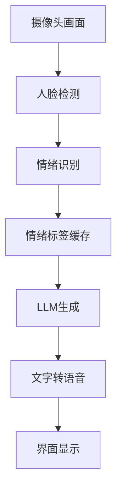
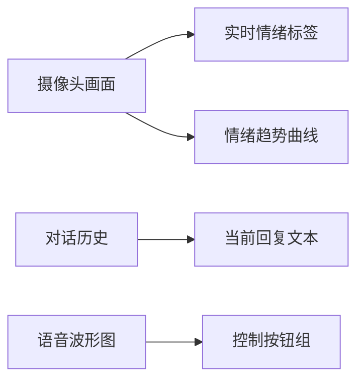

# 基于用户情绪的语音聊天助手
    ```markdown
# 单摄像头情绪对话助手精简部署方案

## 1. 分阶段模型训练策略

### 1.1 数据准备（保持目录结构不变）

创建conda环境，名为baseEmotionconversationBot，python版本为3.10.如需安装依赖，请使用requirements.txt文件 清华源：https://pypi.tuna.tsinghua.edu.cn/simple，
pip3 install torch torchvision torchaudio --index-url https://download.pytorch.org/whl/cu124 -i https://pypi.tuna.tsinghua.edu.cn/simple conda install -c conda-forge ffmpeg【完成】

Kaggle的Facial Affect Dataset Relabeled Balanced训练集[https://www.kaggle.com/datasets/viktormodroczky/facial-affect-data-relabeled/data]，已经下载到本地目录名为archive的文件夹，本次主要是对archive/data_relabeled_balanced_1x/train目录下的['disgust', 'contempt', 'happy', 'sad', 'surprise', 'neutral', 'fear', 'anger']做处理。【完成】
这个数据集的使用案例[https://www.kaggle.com/code/viktormodroczky/resnet-50-imagenet-affect-better-labels-balanced]

将这些目录下的图片转成灰度图，并存入同目录下添加 _gray 后缀的子目录中。使用多线程加快处理速度，并显示进度条。【在convert_gray.py里】，此时archive/data_relabeled_balanced_1x/train的目录结构如下['anger', 'anger_gray', 'contempt', 'contempt_gray', 'disgust', 'disgust_gray', 'fear', 'fear_gray', 'happy', 'happy_gray', 'neutral', 'neutral_gray', 'sad', 'sad_gray', 'surprise', 'surprise_gray']【完成】

```python
# 关键路径配置（需用户修改）
BASE_PATH = "archive/data_relabeled_balanced_1x/train"  # 数据集根目录
COLOR_CLASSES = ['anger', 'contempt', 'disgust', 'fear', 'happy', 'neutral', 'sad', 'surprise']  # 原始彩色目录
GRAY_CLASSES = [c+'_gray' for c in COLOR_CLASSES]  # 灰度图目录
```

### 1.2 两阶段训练流程


#### 1.2 彩色图像训练
```python
# train_color.py 关键参数
cfg = {
    'input_channels': 3,          # 使用RGB三通道
    'image_size': 224,            # 输入尺寸
    'batch_size': 64,             # 根据显存调整
    'base_lr': 3e-4,              # 初始学习率
    'num_epochs': 15,             # 彩色训练轮次
    'model_type': 'efficientnet_b3',  # 基础架构
    'freeze_backbone': True,      # 初始冻结骨干网络
    'class_names': COLOR_CLASSES  # 原始8类别
}
```

### 1.3 数据增强策略
```python
# 彩色阶段增强
color_transform = transforms.Compose([
    transforms.RandomHorizontalFlip(p=0.5),
    transforms.ColorJitter(brightness=0.3, contrast=0.3),  # 色彩增强
    transforms.RandomAffine(degrees=15, shear=10),
    transforms.ToTensor(),
    transforms.Normalize([0.485, 0.456, 0.406], [0.229, 0.224, 0.225])
])
```

## 2. 实时摄像头GUI系统

准备语音认证模型，根据人声判断是否是本人然后进行识别

准备tts模型(利用阿里云的tts模型)

准备asr模型(暂定fish-speach)

准备llm模型
llm模型已完成，使用ollma的两个模型一个deepseek作为思考模型，提取思考推理内容，一个是向量数据库模型，用于存储对话历史
还有使用了一个在线api，只要是兼容openai格式的都可以使用，基于思考内容和向量数据库模型，生成最终的回答。LLM/model.py【完成】

准备情绪识别模型(使用1.4中训练的模型)

### 2.1 系统架构


### 2.2 核心参数配置
```python
# config.py
GUI_CONFIG = {
    'camera_id': 0,               # 默认摄像头索引
    'frame_size': (640, 480),     # 采集分辨率
    'detect_interval': 5,         # 每5帧进行一次情绪识别（平衡性能）
    'emotion_smooth_window': 7,   # 情绪平滑窗口大小
    'tts_speed': 1.1,             # 语音播报速度
    'history_length': 3           # 保留的对话历史轮次
}
```

### 2.3 情绪整合Prompt模板
```python
def build_prompt(emotion, history, text):
    return f"""
[当前时间] {datetime.now().strftime("%H:%M")}
[检测情绪] {emotion['label']} (置信度: {emotion['confidence']:.2f})
[情绪趋势] {analyze_emotion_trend(history)}
[对话历史] {history[-3:]}

用户说：{text}

请生成一个不超过20字的回应，要求：
1. 符合检测到的情绪状态
2. 使用口语化中文
3. 包含适当的情绪反馈词
回答：
"""
```

## 3. 部署执行流程

### 3.1 训练阶段
```bash
# 彩色模型训练（约30分钟）
python train_color.py --data_dir $BASE_PATH --classes ${COLOR_CLASSES[@]}
```

### 3.2 实时部署
```python
# app.py 主循环核心逻辑
while cap.isOpened():
    ret, frame = cap.read()
    if frame_counter % GUI_CONFIG['detect_interval'] == 0:
        # 人脸检测和裁剪
        face_img = detect_face(frame)  
        # 情绪预测（使用ONNX加速）
        emotion = emotion_model.predict(face_img)
        # 更新情绪缓存
        emotion_buffer.append(emotion)
    
    # 实时显示处理
    display_frame = visualize_emotion(frame, current_emotion)
    cv2.imshow('Emotion Chat', display_frame)
    
    # 语音交互触发
    if check_voice_input():
        text = asr_model.recognize()
        response = generate_response(text)
        play_tts(response)
```

## 4. 性能优化关键

### 4.1 模型加速方案
```python
# 转换模型到ONNX格式（推理速度提升2倍）
torch.onnx.export(model, 
                 dummy_input, 
                 "emotion.onnx",
                 opset_version=13,
                 input_names=['input'],
                 output_names=['output'],
                 dynamic_axes={'input': {0: 'batch_size'}})

# 使用TensorRT优化（需要NVIDIA GPU）
trt_model = torch2trt(model, [dummy_input], 
                     fp16_mode=True,
                     max_workspace_size=1<<30)
```

### 4.2 多线程处理
```python
from threading import Thread

# 独立推理线程
class InferenceThread(Thread):
    def run(self):
        while True:
            if not frame_queue.empty():
                frame = frame_queue.get()
                result = model.infer(frame)
                result_queue.put(result)

# 启动处理线程
inference_thread = InferenceThread()
inference_thread.daemon = True
inference_thread.start()
```

## 5. 界面设计要素

### 5.1 可视化组件布局


### 5.2 样式控制参数
```css
/* 自定义主题颜色 */
:root {
  --primary-color: #FF6B6B;  /* 主要情绪指示色 */
  --background-dark: #2D3047;  /* 暗色背景 */
  --text-highlight: #FFE66D;  /* 高亮文字 */
}

.emotion-indicator {
  transition: all 0.3s ease;  /* 平滑动画效果 */
  border-radius: 15px;        /* 圆角设计 */
  box-shadow: 0 4px 6px rgba(0,0,0,0.1);  /* 层次感阴影 */
}
```